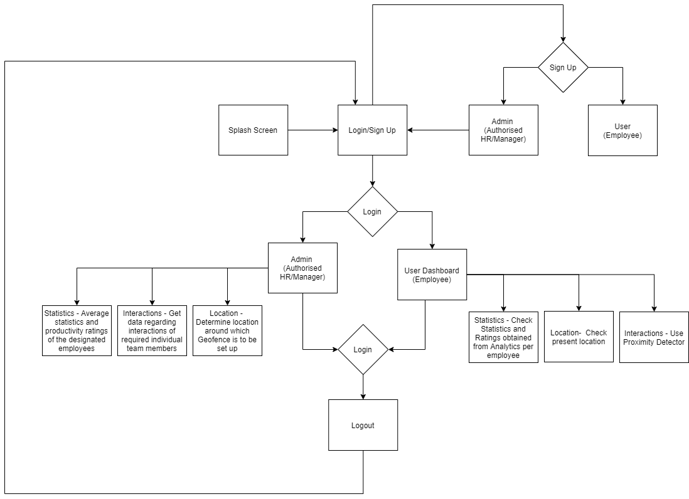

# Productiva
Productiva is an Android application aimed at giving a working employee a resourcefulness, determination and productivity boost in office spaces by creating a more motivating and holistic environment using Geofencing and BLE technoology. This project was made as part a project prototype for the Hackathon Decypher : A Better Tomorrow 

# Project Description
* The “What”: Reduced productivity and morale, and possibly mental health related issues that may be observed in employees, which may affect performance and resourcefulness. Transition back into a professional environment back from the casual comfort provided by WFH after COVID-19 can tend to be demotivating and monotonous.
* The “Why”: This problem statement has been identified in the context of identifying a problem statement that would be essential post COVID-19; while dealing with the aftermath, and for long after the pandemic has passed as well. Most employees have grown accustomed to working from the comfort of their homes, and might find the transition back to a professional environment a bit difficult. Further, in the long run as well, this problem tends to persist and manifest itself in different manners, as the age old stereotyped monotony.
* The “Who”: The primary target consumer demography that has been identified with respect to the “what” and the “why”, are MNCs and corporations that sprawl over a considerable area, and have multiple employees, and want to make a conscious effort in optimizing their workforce, creating a more holistic workplace environment and tending to the needs of their employees; in both financial and mental aspects.
It is no surprise that Monday blues are dreaded by employees, throughout. With the advent of the WFH culture being forcibly enforced, the same Monday blues have become a lot more bearable and comfortable, since now the same tasks can be done from the comfort of one’s home. This would obviously lead to discomfort and unrest if a person is thrust right back into a professional and tightly packed environment.

## Geofencing, Proximity Detection, and Analytics
* Current solution – Presently, some workplaces use beacons as a means to track employee locations in offices. However, this is used only for tracking employee location as a necessary requirement for maintaining social distancing, in most office spaces.
* Our solution brings a unique, game-changing platform to the table that assesses ones productivity and the amount of stress they put themselves under by making use of geofencing and peer to peer BLE technology, coupled with analytics. • Beacons, presently employed in a few offices, use BLE technology, but however require an additional investment, which can prove to be counter-productive. Further, beacons aren’t very effective in processing communication with a server, or storing data. Our application uses peer to peer detection using BLE technology for detecting which employees come in contact with each other more frequently, and geofencing for determining popular locations where more employees tend to spend their free time, and also asses how often employees tend to take a breaks and leisure time. At the end of the day, the day with respect to these peer-peer proximity detection and geofencing features are registered, and can be used for analytics. This system allows more flexibility for a lower cost of investment for the same amount of resources (such as battery life, etc.)
* Our solution gives high emphasis on mental health of employees and helps them reach a healthy balance between their work lives and their social lives. It also creates a fair basis in generating evaluations for the employees, identifying environments which tend to be more comforting for employees, and boosting productivity and morale at a psychological level as well. Deserving employees having a high productivity rate or more resourcefulness can also be rewarded accordingly.
* Admins can define geofences around distinct locations across campus. The amount of time an employee spends in a geofenced area before moving on to another, and the particulars of these areas are recorded. The other employees with whom an employee comes into close proximity with is also made a note of. Employees can also check and identify other employees in their vicinity using this feature, which makes it easy for better networking. Using this data, we obtain sufficient data to determine the resourcefulness, and inter-personal skills of an employee, environments where majority of the workforce feel more comfortable (which can be emulated in the primary workspace for better productivity), amount of time an employee dedicates to their work, identify potential secondary business that can be set up on the premises that might be in tune with employees’ general preferences, and estimate effective value of an employee to the company. 

## Future Implementation
* Integrate geofencing technology by localizing it to beacons, and creating software for beacons that allows beacons to directly transmit data to servers, so that this technology may be effectively applied to organizations for each floor.
* Perform more in depth analysis with solid mathematical foundations for providing statistics that can be used as a valid metric for determining the employee’s resourcefulness.
* Feature for customizing the range of the proximity detector. 
* Creating a web portal, for administrator access, for analytics, as well as viewing the geofence-related details, and proximity logs of each user, and use it for calculating resourcefulness parameters. The statistics of an individual user can be accessed as well.

## Contributers
* Harsha Durvasula
* Anant Thazhemadam
* Ishita Datta
